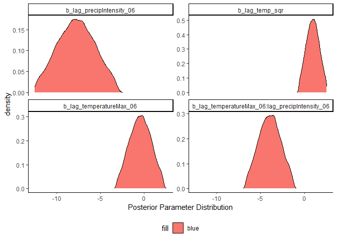

CovidWeather
================

## Analysis:

The purpose of this analysis is to evaluate the impact of our three
weather metrics on **new** Covid-19 cases in California. The complete
and large dataset can be found
[here](https://www.dropbox.com/preview/Public/WeatherData/WeatherCases.csv?role=personal).

The complete code for this post can be found
[here:](https://github.com/kieran11/WeatherCovid/blob/master/CovidAnalysis.Rmd).

The basic California model will hypothesize that the stages of each
opening should increase new cases after a week. Similarly, weather
should work in a similar pattern. Better weather should encourage more
outdoor activity, and we should see a drop in cases up until a certain
point. Temperature rises beyond a certain point will have a positive
association with new cases as it encourages more indoor activity.

The first step is to determine the model. The main choices of the model
are the lag number. Does the temperature three days prior have a greater
influence on new Covid-19 cases than the temperature 13 days prior?
Ideally, we would use a log likelihood model. However, the models are
not nested, and thus we do not use a log likelihood test. A nested
models contains the previous model within it.

As we can see, the model with a six day lag has the lowest AIC, and it
will be the model we evaluate. The `Mdl` column just tells us whether it
is an interaction model or not. The interaction model has an interaction
between temperature and precipiation intensity.

<!--html_preserve-->

<table class="gt_table">

<thead class="gt_col_headings">

<tr>

<th class="gt_col_heading gt_columns_bottom_border gt_left" rowspan="1" colspan="1">

Lags

</th>

<th class="gt_col_heading gt_columns_bottom_border gt_left" rowspan="1" colspan="1">

Mdl

</th>

<th class="gt_col_heading gt_columns_bottom_border gt_right" rowspan="1" colspan="1">

Val

</th>

</tr>

</thead>

<tbody class="gt_table_body">

<tr>

<td class="gt_row gt_left">

06

</td>

<td class="gt_row gt_left">

AICInt

</td>

<td class="gt_row gt_right">

53957.28

</td>

</tr>

<tr>

<td class="gt_row gt_left">

09

</td>

<td class="gt_row gt_left">

AICInt

</td>

<td class="gt_row gt_right">

53960.57

</td>

</tr>

<tr>

<td class="gt_row gt_left">

05

</td>

<td class="gt_row gt_left">

AICInt

</td>

<td class="gt_row gt_right">

53961.45

</td>

</tr>

<tr>

<td class="gt_row gt_left">

11

</td>

<td class="gt_row gt_left">

AICInt

</td>

<td class="gt_row gt_right">

53964.61

</td>

</tr>

<tr>

<td class="gt_row gt_left">

10

</td>

<td class="gt_row gt_left">

AICInt

</td>

<td class="gt_row gt_right">

53965.55

</td>

</tr>

<tr>

<td class="gt_row gt_left">

04

</td>

<td class="gt_row gt_left">

AICInt

</td>

<td class="gt_row gt_right">

53966.48

</td>

</tr>

</tbody>

</table>

<!--/html_preserve-->

After deciding on the number of lags, we try modeling an interaction
between temperature and precipitation intensity. We also try a second
order polynomial as previously described.

The best model is the model with an interaction, and the second order
polynomial. We use a likelihood ratio test, as all three models are
nested.

After deciding on the model, we use a Bayesian work flow. Unfortunately,
there is not enough computing power to check all of the lags, which is
why we previously used a Frequentist work flow.

The next step is model a prior. Ideally, one can use institutional
knowledge to determine the prior. For this modeling exercise, we will
use the function `get_prior` from the `brms` package to determine the
prior. As a comparison, we also use a weak prior. All of the parameters
have been transformed to have a mean of zero, and a standard deviation
of one.

We use the `brms` function `model_weights`. The `model_weights` provides
a weighting system which judges the predictive accuracy of the posterior
distribution. For a more extensive discussion, see
[here](https://discourse.mc-stan.org/t/model-stacking-and-loo-brms-models/4611).

The model weights are based on the Widely Applicable Information
Criterion (WAIC). For a very good explanation and detailed breakdown,
see:
[here](https://bookdown.org/ajkurz/Statistical_Rethinking_recoded/overfitting-regularization-and-information-criteria.html#using-information-criteria).

The below table shows the results.

<!--html_preserve-->

<table class="gt_table">

<thead class="gt_header">

<tr>

<th colspan="4" class="gt_heading gt_title gt_font_normal" style>

Model Evaluation

</th>

</tr>

<tr>

<th colspan="4" class="gt_heading gt_subtitle gt_font_normal gt_bottom_border" style>

</th>

</tr>

</thead>

<thead class="gt_col_headings">

<tr>

<th class="gt_col_heading gt_columns_bottom_border gt_left" rowspan="1" colspan="1">

Models

</th>

<th class="gt_col_heading gt_columns_bottom_border gt_center" rowspan="1" colspan="1">

elpd\_diff

</th>

<th class="gt_col_heading gt_columns_bottom_border gt_center" rowspan="1" colspan="1">

se\_diff

</th>

<th class="gt_col_heading gt_columns_bottom_border gt_right" rowspan="1" colspan="1">

ModelWeights

</th>

</tr>

</thead>

<tbody class="gt_table_body">

<tr>

<td class="gt_row gt_left">

CovidBayesianStdCensus

</td>

<td class="gt_row gt_center">

0.000

</td>

<td class="gt_row gt_center">

0.000

</td>

<td class="gt_row gt_right">

0.814

</td>

</tr>

<tr>

<td class="gt_row gt_left">

CovidBayesian10Census

</td>

<td class="gt_row gt_center">

\-1.704

</td>

<td class="gt_row gt_center">

0.944

</td>

<td class="gt_row gt_right">

0.148

</td>

</tr>

<tr>

<td class="gt_row gt_left">

CovidBayesian10

</td>

<td class="gt_row gt_center">

\-3.621

</td>

<td class="gt_row gt_center">

5.020

</td>

<td class="gt_row gt_right">

0.022

</td>

</tr>

<tr>

<td class="gt_row gt_left">

CovidBayesianStd

</td>

<td class="gt_row gt_center">

\-3.939

</td>

<td class="gt_row gt_center">

4.951

</td>

<td class="gt_row gt_right">

0.016

</td>

</tr>

</tbody>

</table>

<!--/html_preserve-->

As we can see there is not a considerable difference between the models.
The `elpd` difference is smaller, or a similar size to the standard
error. The model weights show that the `CovidBayesianStdCensus` model is
the best model, but there is not a considerable difference between any
of the four models. There is little difference between a weak, normally
distributed prior, and Student’s T prior. There is also little
difference between the addition of the census variables, and the model
that does not have the census variables.

## Checking the models:

Before looking at the credible intervals, and the mean estimate from the
posterior distribution of our two temperature variables, we need to
check the chains.

The chains for all of the models can be found
[here](https://github.com/kieran11/WeatherCovid/tree/master/CovidAnalysis_files/figure-gfm).
There are four trace plots.

As we can see the chains follow the caterpillar like shapes.

The trace are below:

<!-- -->

<!-- -->

<!-- -->

<!-- -->

## Effect of Temperature and Precipitation Intensity

The best model combination was the interaction model, where we modeled
an interaction between the max temperature on a given day, and the
precipitation intensity. In Statistical Rethinking, Richard McElreath
notes that plotting interactions is a much more intuitive method to
understand the effect.

When we look at the posterior distribution for the weather variables, we
see that the 95% credible intervals include zero for
`lag_temperatureMax_06` and `lag_temp_sqr`. The other two weather
variables are the interaction between temperature and precipitation
intensity, and the lag of precipitation
intensity`lag_precipIntensity_06`. The credible intervals for both of
these variables exclude zero.

All of the models can be found
[here](https://github.com/kieran11/WeatherCovid/tree/master/CovidAnalysis_files/figure-gfm).

<!-- -->

<!-- -->

The best model combination was the interaction model, where we modeled
an interaction between the max temperature on a given day, and the
precipitation intensity. In Statistical Rethinking, Richard McElreath
notes that plotting interactions is a much more intuitive method to
understand the effect.

<!-- -->

The best model combination was the interaction model, where we modeled
an interaction between the max temperature on a given day, and the
precipitation intensity. In Statistical Rethinking, Richard McElreath
notes that plotting interactions is a much more intuitive method to
understand the effect.

<!-- -->

The plot above shows the interaction effect. When precipitation
intensity is one standard deviation below mean, we see that as
temperature increases, the estimated new cases rises. However, when
precipitation intensity is one standard deviation above the mean, we see
opposite. As temperature rises, estimated new cases decline. When
precipitation intensity is at the mean, then temperature has little
effect on estimated new cases.
