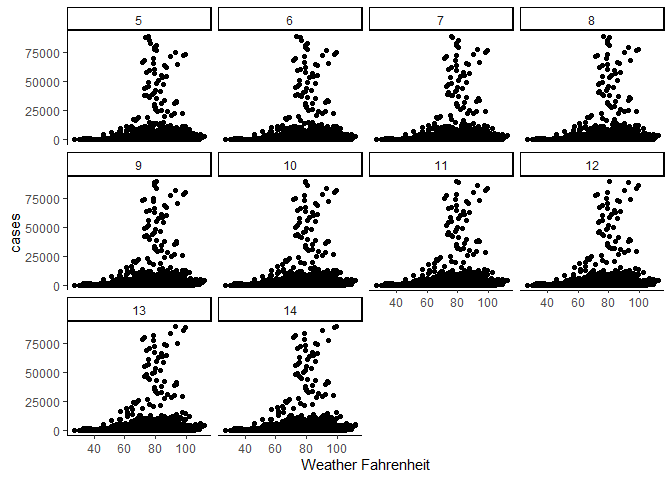
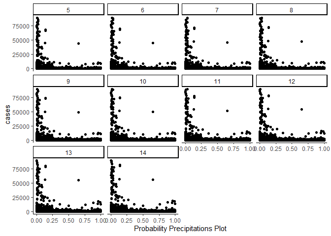
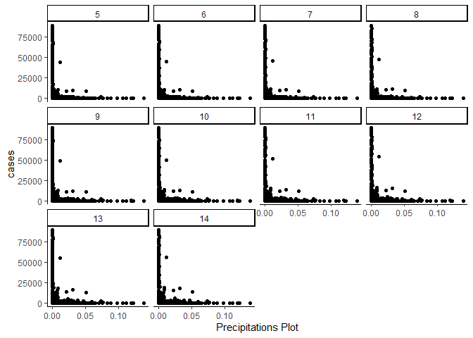
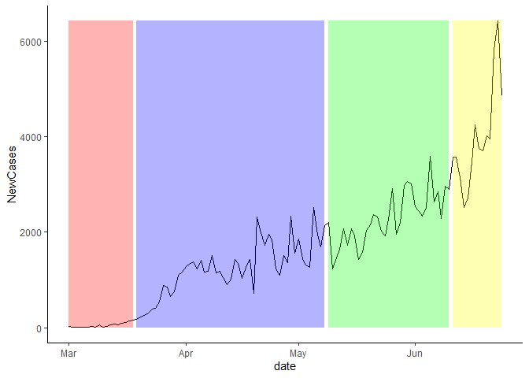
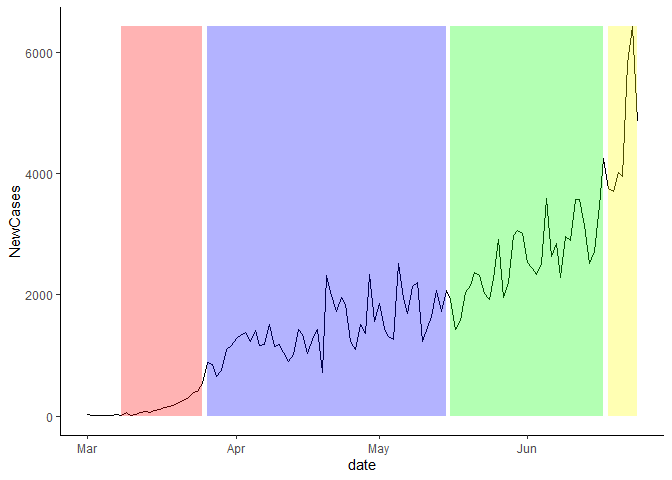
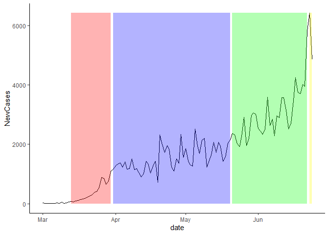

Getting Covid and Weather Data
================

## Weather Data

Many epidemiological experts have linked weather to rising or falling
Covid-19 cases. The first two steps of the process of getting data is as
follows:

1.  The Covid-19 cases by county in the United States (US) can be found
    [here:](https://kjhealy.github.io/covdata/).

2.  The weather data comes from Darksky. We use the package `darksky`.
    `darksky` is a wrapper for the API DarkSky provides.

The package `darksky` and its documentation is
[here:](https://github.com/hrbrmstr/darksky). Importantly, the API will
shutdown at the end of 2021.

In order to get the weather for each county for a given day, we need the
longitude and latitude for each of the counties. The dataset with every
longitude and latitude in a given county is provided by the Open Data
initiative of the U.S. Government. The complete raw dataset can be
downloaded
[here:](https://data.healthcare.gov/dataset/Geocodes-USA-with-Counties/52wv-g36k).
To get a longitude and latitude for each county, we just take the means
by county. It is not a perfect estimation for weather, but depending on
the geographical size of the county, it should work well.

``` r
library(covdata)
library(tidyverse)
library(darksky)
library(ggmap)
## Darksky API: 
DS = "Weather API"
darksky_api_key(DS)
## google maps API: 
GoogleAPI = "API Key"
register_google(key = GoogleAPI)

longlat = readr::read_csv("C:/Users/Kieran Shah/Downloads/Geocodes_USA_with_Counties.csv") %>% 
  filter(!is.na(county)) %>% 
  group_by(county, state) %>% 
  summarise(long = mean(longitude ),
            lat = mean(latitude)) %>% 
  ungroup()

st_crosswalk <- tibble(state = state.name) %>%
  bind_cols(tibble(abb = state.abb)) %>% 
  bind_rows(tibble(state = "District of Columbia", abb = "DC"))

IndlCounties = nytcovcounty %>% 
  distinct(county, state) %>% 
  inner_join(st_crosswalk, by = "state") %>% 
  inner_join(longlat, by = c("county" = "county", "abb" = "state")) %>% 
  inner_join(nytcovcounty , by = c("county", "state")) %>%
  filter(lubridate::month(date) %in% c(3,4,5,6) ) %>% 
  mutate(timeStamp = paste0(date, "T13:00:00")) %>%  
  mutate(TempData = purrr::pmap(list(lat, long, timeStamp), get_forecast_for, 
                                header = TRUE, 
                                exclude = "currently,minutely,hourly,alerts,flags"))

IndlCountiesUnnest = IndlCounties %>%
  mutate(Data2Weather = purrr::map(TempData, ~ .x$daily %>% 
                                     select(temperatureMax , temperatureLow, 
                                                            precipProbability , precipIntensity))) %>% 
  tidyr::unnest(c(Data2Weather))
```

## Other predictors:

There are many factors which are associated with rising, or declining
Covid-19 cases. This post cannot get all of the predictors. Furthermore,
all the relevant predictors are probably unknown at this time.

To get other predictors, we use the package `tidycensus`. After
registering for an API key, you can check all the variables in the
American Community Survey (ACS) with the `load_variables` function.

I pulled median age and median income for this analysis.

The weather data, Covid-19 data, and ACS data are then combined
together.

``` r
library(dplyr)

tidycensus::census_api_key("API Key")
v17 <- tidycensus::load_variables(2017, "acs5", cache = TRUE)

MedianAgeCounty <- tidycensus::get_acs(geography = "county",
                                       variables = c(MedianAge = "B01002_001"),
                                       #state = "VT",
                                       year = 2017)

Poverty = tidycensus::get_acs(geography = "county",
                              variables = c(MedianIncome = "B17020_001"),
                              #state = "VT",
                              year = 2017)

ExtaVariables = inner_join(Poverty %>% 
                             select(MedianIncome = estimate, GEOID), 
                           MedianAgeCounty %>% 
                             select(GEOID, NAME, MedianAge = estimate ), by = "GEOID")
```

## Focus on California

While using the entire U.S. dataset provides the greatest amount of
variation, there are 50 state governments provided different policies.
In order to isolate government policy without researching every 50 state
policies, we can focus on California. California has both a lot of
variation in temperatures and cases by county, it provides an
interesting case study.

California has opened up to Stage 3 as of July 22.

1.  California closed for shelter-at-home on March 19, 2020.
2.  California opened for stage 2 on May 8, 2020.
3.  California opened for stage 3 on June June 12, 2020.

An important caveat is that some of the openings are based on meeting
county thresholds.

The first step is to create multiple lags for weather. Covid-19 cases
will show up after temperature changes. To do so, we follow
[this](https://purrple.cat/blog/2018/03/02/multiple-lags-with-tidy-evaluation/)
blog post.

``` r
lags <- function(var, n=10){
  var <- enquo(var)
  
  indices <- seq_len(n)
  purrr::map( indices, ~quo(lag(!!var, !!.x)) ) %>% 
    purrr::set_names(sprintf("lag_%s_%02d", quo_text(var), indices))
  
}
```

## Basic Correlations:

Next, we take a look at the data. How do the scatter plots look
comparing Covid-19 cases and the four different weather variables.

1.  Max Temperature:

<!-- -->

The below table shows the distribution by range of max temperature. The
rows are the number of days in lags. The columns are the temperature
ranges.

<!--html_preserve-->

<style>html {
  font-family: -apple-system, BlinkMacSystemFont, 'Segoe UI', Roboto, Oxygen, Ubuntu, Cantarell, 'Helvetica Neue', 'Fira Sans', 'Droid Sans', Arial, sans-serif;
}

#utpykhocmr .gt_table {
  display: table;
  border-collapse: collapse;
  margin-left: auto;
  margin-right: auto;
  color: #333333;
  font-size: 16px;
  background-color: #FFFFFF;
  width: auto;
  border-top-style: solid;
  border-top-width: 2px;
  border-top-color: #A8A8A8;
  border-right-style: none;
  border-right-width: 2px;
  border-right-color: #D3D3D3;
  border-bottom-style: solid;
  border-bottom-width: 2px;
  border-bottom-color: #A8A8A8;
  border-left-style: none;
  border-left-width: 2px;
  border-left-color: #D3D3D3;
}

#utpykhocmr .gt_heading {
  background-color: #FFFFFF;
  text-align: center;
  border-bottom-color: #FFFFFF;
  border-left-style: none;
  border-left-width: 1px;
  border-left-color: #D3D3D3;
  border-right-style: none;
  border-right-width: 1px;
  border-right-color: #D3D3D3;
}

#utpykhocmr .gt_title {
  color: #333333;
  font-size: 125%;
  font-weight: initial;
  padding-top: 4px;
  padding-bottom: 4px;
  border-bottom-color: #FFFFFF;
  border-bottom-width: 0;
}

#utpykhocmr .gt_subtitle {
  color: #333333;
  font-size: 85%;
  font-weight: initial;
  padding-top: 0;
  padding-bottom: 4px;
  border-top-color: #FFFFFF;
  border-top-width: 0;
}

#utpykhocmr .gt_bottom_border {
  border-bottom-style: solid;
  border-bottom-width: 2px;
  border-bottom-color: #D3D3D3;
}

#utpykhocmr .gt_col_headings {
  border-top-style: solid;
  border-top-width: 2px;
  border-top-color: #D3D3D3;
  border-bottom-style: solid;
  border-bottom-width: 2px;
  border-bottom-color: #D3D3D3;
  border-left-style: none;
  border-left-width: 1px;
  border-left-color: #D3D3D3;
  border-right-style: none;
  border-right-width: 1px;
  border-right-color: #D3D3D3;
}

#utpykhocmr .gt_col_heading {
  color: #333333;
  background-color: #FFFFFF;
  font-size: 100%;
  font-weight: normal;
  text-transform: inherit;
  border-left-style: none;
  border-left-width: 1px;
  border-left-color: #D3D3D3;
  border-right-style: none;
  border-right-width: 1px;
  border-right-color: #D3D3D3;
  vertical-align: bottom;
  padding-top: 5px;
  padding-bottom: 6px;
  padding-left: 5px;
  padding-right: 5px;
  overflow-x: hidden;
}

#utpykhocmr .gt_column_spanner_outer {
  color: #333333;
  background-color: #FFFFFF;
  font-size: 100%;
  font-weight: normal;
  text-transform: inherit;
  padding-top: 0;
  padding-bottom: 0;
  padding-left: 4px;
  padding-right: 4px;
}

#utpykhocmr .gt_column_spanner_outer:first-child {
  padding-left: 0;
}

#utpykhocmr .gt_column_spanner_outer:last-child {
  padding-right: 0;
}

#utpykhocmr .gt_column_spanner {
  border-bottom-style: solid;
  border-bottom-width: 2px;
  border-bottom-color: #D3D3D3;
  vertical-align: bottom;
  padding-top: 5px;
  padding-bottom: 6px;
  overflow-x: hidden;
  display: inline-block;
  width: 100%;
}

#utpykhocmr .gt_group_heading {
  padding: 8px;
  color: #333333;
  background-color: #FFFFFF;
  font-size: 100%;
  font-weight: initial;
  text-transform: inherit;
  border-top-style: solid;
  border-top-width: 2px;
  border-top-color: #D3D3D3;
  border-bottom-style: solid;
  border-bottom-width: 2px;
  border-bottom-color: #D3D3D3;
  border-left-style: none;
  border-left-width: 1px;
  border-left-color: #D3D3D3;
  border-right-style: none;
  border-right-width: 1px;
  border-right-color: #D3D3D3;
  vertical-align: middle;
}

#utpykhocmr .gt_empty_group_heading {
  padding: 0.5px;
  color: #333333;
  background-color: #FFFFFF;
  font-size: 100%;
  font-weight: initial;
  border-top-style: solid;
  border-top-width: 2px;
  border-top-color: #D3D3D3;
  border-bottom-style: solid;
  border-bottom-width: 2px;
  border-bottom-color: #D3D3D3;
  vertical-align: middle;
}

#utpykhocmr .gt_striped {
  background-color: rgba(128, 128, 128, 0.05);
}

#utpykhocmr .gt_from_md > :first-child {
  margin-top: 0;
}

#utpykhocmr .gt_from_md > :last-child {
  margin-bottom: 0;
}

#utpykhocmr .gt_row {
  padding-top: 8px;
  padding-bottom: 8px;
  padding-left: 5px;
  padding-right: 5px;
  margin: 10px;
  border-top-style: solid;
  border-top-width: 1px;
  border-top-color: #D3D3D3;
  border-left-style: none;
  border-left-width: 1px;
  border-left-color: #D3D3D3;
  border-right-style: none;
  border-right-width: 1px;
  border-right-color: #D3D3D3;
  vertical-align: middle;
  overflow-x: hidden;
}

#utpykhocmr .gt_stub {
  color: #333333;
  background-color: #FFFFFF;
  font-size: 100%;
  font-weight: initial;
  text-transform: inherit;
  border-right-style: solid;
  border-right-width: 2px;
  border-right-color: #D3D3D3;
  padding-left: 12px;
}

#utpykhocmr .gt_summary_row {
  color: #333333;
  background-color: #FFFFFF;
  text-transform: inherit;
  padding-top: 8px;
  padding-bottom: 8px;
  padding-left: 5px;
  padding-right: 5px;
}

#utpykhocmr .gt_first_summary_row {
  padding-top: 8px;
  padding-bottom: 8px;
  padding-left: 5px;
  padding-right: 5px;
  border-top-style: solid;
  border-top-width: 2px;
  border-top-color: #D3D3D3;
}

#utpykhocmr .gt_grand_summary_row {
  color: #333333;
  background-color: #FFFFFF;
  text-transform: inherit;
  padding-top: 8px;
  padding-bottom: 8px;
  padding-left: 5px;
  padding-right: 5px;
}

#utpykhocmr .gt_first_grand_summary_row {
  padding-top: 8px;
  padding-bottom: 8px;
  padding-left: 5px;
  padding-right: 5px;
  border-top-style: double;
  border-top-width: 6px;
  border-top-color: #D3D3D3;
}

#utpykhocmr .gt_table_body {
  border-top-style: solid;
  border-top-width: 2px;
  border-top-color: #D3D3D3;
  border-bottom-style: solid;
  border-bottom-width: 2px;
  border-bottom-color: #D3D3D3;
}

#utpykhocmr .gt_footnotes {
  color: #333333;
  background-color: #FFFFFF;
  border-bottom-style: none;
  border-bottom-width: 2px;
  border-bottom-color: #D3D3D3;
  border-left-style: none;
  border-left-width: 2px;
  border-left-color: #D3D3D3;
  border-right-style: none;
  border-right-width: 2px;
  border-right-color: #D3D3D3;
}

#utpykhocmr .gt_footnote {
  margin: 0px;
  font-size: 90%;
  padding: 4px;
}

#utpykhocmr .gt_sourcenotes {
  color: #333333;
  background-color: #FFFFFF;
  border-bottom-style: none;
  border-bottom-width: 2px;
  border-bottom-color: #D3D3D3;
  border-left-style: none;
  border-left-width: 2px;
  border-left-color: #D3D3D3;
  border-right-style: none;
  border-right-width: 2px;
  border-right-color: #D3D3D3;
}

#utpykhocmr .gt_sourcenote {
  font-size: 90%;
  padding: 4px;
}

#utpykhocmr .gt_left {
  text-align: left;
}

#utpykhocmr .gt_center {
  text-align: center;
}

#utpykhocmr .gt_right {
  text-align: right;
  font-variant-numeric: tabular-nums;
}

#utpykhocmr .gt_font_normal {
  font-weight: normal;
}

#utpykhocmr .gt_font_bold {
  font-weight: bold;
}

#utpykhocmr .gt_font_italic {
  font-style: italic;
}

#utpykhocmr .gt_super {
  font-size: 65%;
}

#utpykhocmr .gt_footnote_marks {
  font-style: italic;
  font-size: 65%;
}
</style>

<div id="utpykhocmr" style="overflow-x:auto;overflow-y:auto;width:auto;height:auto;">

<table class="gt_table">

<thead class="gt_col_headings">

<tr>

<th class="gt_col_heading gt_center gt_columns_bottom_border" rowspan="2" colspan="1">

TempDaySince

</th>

<th class="gt_center gt_columns_top_border gt_column_spanner_outer" rowspan="1" colspan="5">

<span class="gt_column_spanner">Range</span>

</th>

</tr>

<tr>

<th class="gt_col_heading gt_columns_bottom_border gt_center" rowspan="1" colspan="1">

\[27,59.3\]

</th>

<th class="gt_col_heading gt_columns_bottom_border gt_center" rowspan="1" colspan="1">

(59.3,66.8\]

</th>

<th class="gt_col_heading gt_columns_bottom_border gt_center" rowspan="1" colspan="1">

(66.8,74.1\]

</th>

<th class="gt_col_heading gt_columns_bottom_border gt_center" rowspan="1" colspan="1">

(74.1,83\]

</th>

<th class="gt_col_heading gt_columns_bottom_border gt_center" rowspan="1" colspan="1">

(83,112\]

</th>

</tr>

</thead>

<tbody class="gt_table_body">

<tr>

<td class="gt_row gt_right">

5

</td>

<td class="gt_row gt_right">

24.0

</td>

<td class="gt_row gt_right">

60.5

</td>

<td class="gt_row gt_right">

104.5

</td>

<td class="gt_row gt_right">

163.5

</td>

<td class="gt_row gt_right">

316.5

</td>

</tr>

<tr>

<td class="gt_row gt_right">

6

</td>

<td class="gt_row gt_right">

27.0

</td>

<td class="gt_row gt_right">

66.0

</td>

<td class="gt_row gt_right">

106.0

</td>

<td class="gt_row gt_right">

171.0

</td>

<td class="gt_row gt_right">

325.0

</td>

</tr>

<tr>

<td class="gt_row gt_right">

7

</td>

<td class="gt_row gt_right">

30.0

</td>

<td class="gt_row gt_right">

74.0

</td>

<td class="gt_row gt_right">

110.0

</td>

<td class="gt_row gt_right">

175.0

</td>

<td class="gt_row gt_right">

337.0

</td>

</tr>

<tr>

<td class="gt_row gt_right">

8

</td>

<td class="gt_row gt_right">

33.0

</td>

<td class="gt_row gt_right">

80.5

</td>

<td class="gt_row gt_right">

116.0

</td>

<td class="gt_row gt_right">

184.0

</td>

<td class="gt_row gt_right">

349.5

</td>

</tr>

<tr>

<td class="gt_row gt_right">

9

</td>

<td class="gt_row gt_right">

34.0

</td>

<td class="gt_row gt_right">

87.0

</td>

<td class="gt_row gt_right">

120.0

</td>

<td class="gt_row gt_right">

184.0

</td>

<td class="gt_row gt_right">

358.0

</td>

</tr>

<tr>

<td class="gt_row gt_right">

10

</td>

<td class="gt_row gt_right">

36.5

</td>

<td class="gt_row gt_right">

95.0

</td>

<td class="gt_row gt_right">

126.0

</td>

<td class="gt_row gt_right">

178.0

</td>

<td class="gt_row gt_right">

358.0

</td>

</tr>

<tr>

<td class="gt_row gt_right">

11

</td>

<td class="gt_row gt_right">

39.0

</td>

<td class="gt_row gt_right">

102.0

</td>

<td class="gt_row gt_right">

137.5

</td>

<td class="gt_row gt_right">

177.5

</td>

<td class="gt_row gt_right">

367.0

</td>

</tr>

<tr>

<td class="gt_row gt_right">

12

</td>

<td class="gt_row gt_right">

41.0

</td>

<td class="gt_row gt_right">

105.0

</td>

<td class="gt_row gt_right">

140.0

</td>

<td class="gt_row gt_right">

172.0

</td>

<td class="gt_row gt_right">

375.5

</td>

</tr>

<tr>

<td class="gt_row gt_right">

13

</td>

<td class="gt_row gt_right">

42.0

</td>

<td class="gt_row gt_right">

110.0

</td>

<td class="gt_row gt_right">

145.0

</td>

<td class="gt_row gt_right">

176.5

</td>

<td class="gt_row gt_right">

386.0

</td>

</tr>

<tr>

<td class="gt_row gt_right">

14

</td>

<td class="gt_row gt_right">

44.0

</td>

<td class="gt_row gt_right">

113.0

</td>

<td class="gt_row gt_right">

149.0

</td>

<td class="gt_row gt_right">

187.5

</td>

<td class="gt_row gt_right">

389.0

</td>

</tr>

</tbody>

</table>

</div>

<!--/html_preserve-->

Both the plots and the table above show that the lag and the higher
temperatures seem to be correlated with higher cases. The greater the
lag the more cases, and the greater the temperature, the greater the new
cases.

2.  Precipitation Probability:

<!-- -->

The below table shows the distribution by range of max temperature.

<!--html_preserve-->

<style>html {
  font-family: -apple-system, BlinkMacSystemFont, 'Segoe UI', Roboto, Oxygen, Ubuntu, Cantarell, 'Helvetica Neue', 'Fira Sans', 'Droid Sans', Arial, sans-serif;
}

#ayaweaufnx .gt_table {
  display: table;
  border-collapse: collapse;
  margin-left: auto;
  margin-right: auto;
  color: #333333;
  font-size: 16px;
  background-color: #FFFFFF;
  width: auto;
  border-top-style: solid;
  border-top-width: 2px;
  border-top-color: #A8A8A8;
  border-right-style: none;
  border-right-width: 2px;
  border-right-color: #D3D3D3;
  border-bottom-style: solid;
  border-bottom-width: 2px;
  border-bottom-color: #A8A8A8;
  border-left-style: none;
  border-left-width: 2px;
  border-left-color: #D3D3D3;
}

#ayaweaufnx .gt_heading {
  background-color: #FFFFFF;
  text-align: center;
  border-bottom-color: #FFFFFF;
  border-left-style: none;
  border-left-width: 1px;
  border-left-color: #D3D3D3;
  border-right-style: none;
  border-right-width: 1px;
  border-right-color: #D3D3D3;
}

#ayaweaufnx .gt_title {
  color: #333333;
  font-size: 125%;
  font-weight: initial;
  padding-top: 4px;
  padding-bottom: 4px;
  border-bottom-color: #FFFFFF;
  border-bottom-width: 0;
}

#ayaweaufnx .gt_subtitle {
  color: #333333;
  font-size: 85%;
  font-weight: initial;
  padding-top: 0;
  padding-bottom: 4px;
  border-top-color: #FFFFFF;
  border-top-width: 0;
}

#ayaweaufnx .gt_bottom_border {
  border-bottom-style: solid;
  border-bottom-width: 2px;
  border-bottom-color: #D3D3D3;
}

#ayaweaufnx .gt_col_headings {
  border-top-style: solid;
  border-top-width: 2px;
  border-top-color: #D3D3D3;
  border-bottom-style: solid;
  border-bottom-width: 2px;
  border-bottom-color: #D3D3D3;
  border-left-style: none;
  border-left-width: 1px;
  border-left-color: #D3D3D3;
  border-right-style: none;
  border-right-width: 1px;
  border-right-color: #D3D3D3;
}

#ayaweaufnx .gt_col_heading {
  color: #333333;
  background-color: #FFFFFF;
  font-size: 100%;
  font-weight: normal;
  text-transform: inherit;
  border-left-style: none;
  border-left-width: 1px;
  border-left-color: #D3D3D3;
  border-right-style: none;
  border-right-width: 1px;
  border-right-color: #D3D3D3;
  vertical-align: bottom;
  padding-top: 5px;
  padding-bottom: 6px;
  padding-left: 5px;
  padding-right: 5px;
  overflow-x: hidden;
}

#ayaweaufnx .gt_column_spanner_outer {
  color: #333333;
  background-color: #FFFFFF;
  font-size: 100%;
  font-weight: normal;
  text-transform: inherit;
  padding-top: 0;
  padding-bottom: 0;
  padding-left: 4px;
  padding-right: 4px;
}

#ayaweaufnx .gt_column_spanner_outer:first-child {
  padding-left: 0;
}

#ayaweaufnx .gt_column_spanner_outer:last-child {
  padding-right: 0;
}

#ayaweaufnx .gt_column_spanner {
  border-bottom-style: solid;
  border-bottom-width: 2px;
  border-bottom-color: #D3D3D3;
  vertical-align: bottom;
  padding-top: 5px;
  padding-bottom: 6px;
  overflow-x: hidden;
  display: inline-block;
  width: 100%;
}

#ayaweaufnx .gt_group_heading {
  padding: 8px;
  color: #333333;
  background-color: #FFFFFF;
  font-size: 100%;
  font-weight: initial;
  text-transform: inherit;
  border-top-style: solid;
  border-top-width: 2px;
  border-top-color: #D3D3D3;
  border-bottom-style: solid;
  border-bottom-width: 2px;
  border-bottom-color: #D3D3D3;
  border-left-style: none;
  border-left-width: 1px;
  border-left-color: #D3D3D3;
  border-right-style: none;
  border-right-width: 1px;
  border-right-color: #D3D3D3;
  vertical-align: middle;
}

#ayaweaufnx .gt_empty_group_heading {
  padding: 0.5px;
  color: #333333;
  background-color: #FFFFFF;
  font-size: 100%;
  font-weight: initial;
  border-top-style: solid;
  border-top-width: 2px;
  border-top-color: #D3D3D3;
  border-bottom-style: solid;
  border-bottom-width: 2px;
  border-bottom-color: #D3D3D3;
  vertical-align: middle;
}

#ayaweaufnx .gt_striped {
  background-color: rgba(128, 128, 128, 0.05);
}

#ayaweaufnx .gt_from_md > :first-child {
  margin-top: 0;
}

#ayaweaufnx .gt_from_md > :last-child {
  margin-bottom: 0;
}

#ayaweaufnx .gt_row {
  padding-top: 8px;
  padding-bottom: 8px;
  padding-left: 5px;
  padding-right: 5px;
  margin: 10px;
  border-top-style: solid;
  border-top-width: 1px;
  border-top-color: #D3D3D3;
  border-left-style: none;
  border-left-width: 1px;
  border-left-color: #D3D3D3;
  border-right-style: none;
  border-right-width: 1px;
  border-right-color: #D3D3D3;
  vertical-align: middle;
  overflow-x: hidden;
}

#ayaweaufnx .gt_stub {
  color: #333333;
  background-color: #FFFFFF;
  font-size: 100%;
  font-weight: initial;
  text-transform: inherit;
  border-right-style: solid;
  border-right-width: 2px;
  border-right-color: #D3D3D3;
  padding-left: 12px;
}

#ayaweaufnx .gt_summary_row {
  color: #333333;
  background-color: #FFFFFF;
  text-transform: inherit;
  padding-top: 8px;
  padding-bottom: 8px;
  padding-left: 5px;
  padding-right: 5px;
}

#ayaweaufnx .gt_first_summary_row {
  padding-top: 8px;
  padding-bottom: 8px;
  padding-left: 5px;
  padding-right: 5px;
  border-top-style: solid;
  border-top-width: 2px;
  border-top-color: #D3D3D3;
}

#ayaweaufnx .gt_grand_summary_row {
  color: #333333;
  background-color: #FFFFFF;
  text-transform: inherit;
  padding-top: 8px;
  padding-bottom: 8px;
  padding-left: 5px;
  padding-right: 5px;
}

#ayaweaufnx .gt_first_grand_summary_row {
  padding-top: 8px;
  padding-bottom: 8px;
  padding-left: 5px;
  padding-right: 5px;
  border-top-style: double;
  border-top-width: 6px;
  border-top-color: #D3D3D3;
}

#ayaweaufnx .gt_table_body {
  border-top-style: solid;
  border-top-width: 2px;
  border-top-color: #D3D3D3;
  border-bottom-style: solid;
  border-bottom-width: 2px;
  border-bottom-color: #D3D3D3;
}

#ayaweaufnx .gt_footnotes {
  color: #333333;
  background-color: #FFFFFF;
  border-bottom-style: none;
  border-bottom-width: 2px;
  border-bottom-color: #D3D3D3;
  border-left-style: none;
  border-left-width: 2px;
  border-left-color: #D3D3D3;
  border-right-style: none;
  border-right-width: 2px;
  border-right-color: #D3D3D3;
}

#ayaweaufnx .gt_footnote {
  margin: 0px;
  font-size: 90%;
  padding: 4px;
}

#ayaweaufnx .gt_sourcenotes {
  color: #333333;
  background-color: #FFFFFF;
  border-bottom-style: none;
  border-bottom-width: 2px;
  border-bottom-color: #D3D3D3;
  border-left-style: none;
  border-left-width: 2px;
  border-left-color: #D3D3D3;
  border-right-style: none;
  border-right-width: 2px;
  border-right-color: #D3D3D3;
}

#ayaweaufnx .gt_sourcenote {
  font-size: 90%;
  padding: 4px;
}

#ayaweaufnx .gt_left {
  text-align: left;
}

#ayaweaufnx .gt_center {
  text-align: center;
}

#ayaweaufnx .gt_right {
  text-align: right;
  font-variant-numeric: tabular-nums;
}

#ayaweaufnx .gt_font_normal {
  font-weight: normal;
}

#ayaweaufnx .gt_font_bold {
  font-weight: bold;
}

#ayaweaufnx .gt_font_italic {
  font-style: italic;
}

#ayaweaufnx .gt_super {
  font-size: 65%;
}

#ayaweaufnx .gt_footnote_marks {
  font-style: italic;
  font-size: 65%;
}
</style>

<div id="ayaweaufnx" style="overflow-x:auto;overflow-y:auto;width:auto;height:auto;">

<table class="gt_table">

<thead class="gt_col_headings">

<tr>

<th class="gt_col_heading gt_center gt_columns_bottom_border" rowspan="2" colspan="1">

TempDaySince

</th>

<th class="gt_center gt_columns_top_border gt_column_spanner_outer" rowspan="1" colspan="5">

<span class="gt_column_spanner">Range</span>

</th>

</tr>

<tr>

<th class="gt_col_heading gt_columns_bottom_border gt_center" rowspan="1" colspan="1">

\[0,0.02\]

</th>

<th class="gt_col_heading gt_columns_bottom_border gt_center" rowspan="1" colspan="1">

(0.02,0.04\]

</th>

<th class="gt_col_heading gt_columns_bottom_border gt_center" rowspan="1" colspan="1">

(0.04,0.09\]

</th>

<th class="gt_col_heading gt_columns_bottom_border gt_center" rowspan="1" colspan="1">

(0.09,0.37\]

</th>

<th class="gt_col_heading gt_columns_bottom_border gt_center" rowspan="1" colspan="1">

(0.37,1\]

</th>

</tr>

</thead>

<tbody class="gt_table_body">

<tr>

<td class="gt_row gt_right">

5

</td>

<td class="gt_row gt_right">

270.0

</td>

<td class="gt_row gt_right">

113.0

</td>

<td class="gt_row gt_right">

91.0

</td>

<td class="gt_row gt_right">

49.5

</td>

<td class="gt_row gt_right">

35

</td>

</tr>

<tr>

<td class="gt_row gt_right">

6

</td>

<td class="gt_row gt_right">

273.5

</td>

<td class="gt_row gt_right">

118.0

</td>

<td class="gt_row gt_right">

94.5

</td>

<td class="gt_row gt_right">

52.0

</td>

<td class="gt_row gt_right">

39

</td>

</tr>

<tr>

<td class="gt_row gt_right">

7

</td>

<td class="gt_row gt_right">

278.0

</td>

<td class="gt_row gt_right">

123.5

</td>

<td class="gt_row gt_right">

97.0

</td>

<td class="gt_row gt_right">

53.0

</td>

<td class="gt_row gt_right">

41

</td>

</tr>

<tr>

<td class="gt_row gt_right">

8

</td>

<td class="gt_row gt_right">

285.5

</td>

<td class="gt_row gt_right">

129.0

</td>

<td class="gt_row gt_right">

101.5

</td>

<td class="gt_row gt_right">

55.0

</td>

<td class="gt_row gt_right">

44

</td>

</tr>

<tr>

<td class="gt_row gt_right">

9

</td>

<td class="gt_row gt_right">

291.5

</td>

<td class="gt_row gt_right">

136.0

</td>

<td class="gt_row gt_right">

104.0

</td>

<td class="gt_row gt_right">

62.0

</td>

<td class="gt_row gt_right">

48

</td>

</tr>

<tr>

<td class="gt_row gt_right">

10

</td>

<td class="gt_row gt_right">

297.0

</td>

<td class="gt_row gt_right">

129.0

</td>

<td class="gt_row gt_right">

108.0

</td>

<td class="gt_row gt_right">

71.0

</td>

<td class="gt_row gt_right">

50

</td>

</tr>

<tr>

<td class="gt_row gt_right">

11

</td>

<td class="gt_row gt_right">

301.0

</td>

<td class="gt_row gt_right">

129.0

</td>

<td class="gt_row gt_right">

110.0

</td>

<td class="gt_row gt_right">

77.5

</td>

<td class="gt_row gt_right">

54

</td>

</tr>

<tr>

<td class="gt_row gt_right">

12

</td>

<td class="gt_row gt_right">

309.0

</td>

<td class="gt_row gt_right">

140.0

</td>

<td class="gt_row gt_right">

112.0

</td>

<td class="gt_row gt_right">

82.0

</td>

<td class="gt_row gt_right">

64

</td>

</tr>

<tr>

<td class="gt_row gt_right">

13

</td>

<td class="gt_row gt_right">

312.0

</td>

<td class="gt_row gt_right">

140.0

</td>

<td class="gt_row gt_right">

112.0

</td>

<td class="gt_row gt_right">

89.0

</td>

<td class="gt_row gt_right">

71

</td>

</tr>

<tr>

<td class="gt_row gt_right">

14

</td>

<td class="gt_row gt_right">

317.0

</td>

<td class="gt_row gt_right">

145.0

</td>

<td class="gt_row gt_right">

116.0

</td>

<td class="gt_row gt_right">

100.0

</td>

<td class="gt_row gt_right">

77

</td>

</tr>

</tbody>

</table>

</div>

<!--/html_preserve-->

3.  Precipitation Intensity:

<!-- -->

The below table shows the distribution by range of max temperature.

<!--html_preserve-->

<style>html {
  font-family: -apple-system, BlinkMacSystemFont, 'Segoe UI', Roboto, Oxygen, Ubuntu, Cantarell, 'Helvetica Neue', 'Fira Sans', 'Droid Sans', Arial, sans-serif;
}

#zpmmocdhhv .gt_table {
  display: table;
  border-collapse: collapse;
  margin-left: auto;
  margin-right: auto;
  color: #333333;
  font-size: 16px;
  background-color: #FFFFFF;
  width: auto;
  border-top-style: solid;
  border-top-width: 2px;
  border-top-color: #A8A8A8;
  border-right-style: none;
  border-right-width: 2px;
  border-right-color: #D3D3D3;
  border-bottom-style: solid;
  border-bottom-width: 2px;
  border-bottom-color: #A8A8A8;
  border-left-style: none;
  border-left-width: 2px;
  border-left-color: #D3D3D3;
}

#zpmmocdhhv .gt_heading {
  background-color: #FFFFFF;
  text-align: center;
  border-bottom-color: #FFFFFF;
  border-left-style: none;
  border-left-width: 1px;
  border-left-color: #D3D3D3;
  border-right-style: none;
  border-right-width: 1px;
  border-right-color: #D3D3D3;
}

#zpmmocdhhv .gt_title {
  color: #333333;
  font-size: 125%;
  font-weight: initial;
  padding-top: 4px;
  padding-bottom: 4px;
  border-bottom-color: #FFFFFF;
  border-bottom-width: 0;
}

#zpmmocdhhv .gt_subtitle {
  color: #333333;
  font-size: 85%;
  font-weight: initial;
  padding-top: 0;
  padding-bottom: 4px;
  border-top-color: #FFFFFF;
  border-top-width: 0;
}

#zpmmocdhhv .gt_bottom_border {
  border-bottom-style: solid;
  border-bottom-width: 2px;
  border-bottom-color: #D3D3D3;
}

#zpmmocdhhv .gt_col_headings {
  border-top-style: solid;
  border-top-width: 2px;
  border-top-color: #D3D3D3;
  border-bottom-style: solid;
  border-bottom-width: 2px;
  border-bottom-color: #D3D3D3;
  border-left-style: none;
  border-left-width: 1px;
  border-left-color: #D3D3D3;
  border-right-style: none;
  border-right-width: 1px;
  border-right-color: #D3D3D3;
}

#zpmmocdhhv .gt_col_heading {
  color: #333333;
  background-color: #FFFFFF;
  font-size: 100%;
  font-weight: normal;
  text-transform: inherit;
  border-left-style: none;
  border-left-width: 1px;
  border-left-color: #D3D3D3;
  border-right-style: none;
  border-right-width: 1px;
  border-right-color: #D3D3D3;
  vertical-align: bottom;
  padding-top: 5px;
  padding-bottom: 6px;
  padding-left: 5px;
  padding-right: 5px;
  overflow-x: hidden;
}

#zpmmocdhhv .gt_column_spanner_outer {
  color: #333333;
  background-color: #FFFFFF;
  font-size: 100%;
  font-weight: normal;
  text-transform: inherit;
  padding-top: 0;
  padding-bottom: 0;
  padding-left: 4px;
  padding-right: 4px;
}

#zpmmocdhhv .gt_column_spanner_outer:first-child {
  padding-left: 0;
}

#zpmmocdhhv .gt_column_spanner_outer:last-child {
  padding-right: 0;
}

#zpmmocdhhv .gt_column_spanner {
  border-bottom-style: solid;
  border-bottom-width: 2px;
  border-bottom-color: #D3D3D3;
  vertical-align: bottom;
  padding-top: 5px;
  padding-bottom: 6px;
  overflow-x: hidden;
  display: inline-block;
  width: 100%;
}

#zpmmocdhhv .gt_group_heading {
  padding: 8px;
  color: #333333;
  background-color: #FFFFFF;
  font-size: 100%;
  font-weight: initial;
  text-transform: inherit;
  border-top-style: solid;
  border-top-width: 2px;
  border-top-color: #D3D3D3;
  border-bottom-style: solid;
  border-bottom-width: 2px;
  border-bottom-color: #D3D3D3;
  border-left-style: none;
  border-left-width: 1px;
  border-left-color: #D3D3D3;
  border-right-style: none;
  border-right-width: 1px;
  border-right-color: #D3D3D3;
  vertical-align: middle;
}

#zpmmocdhhv .gt_empty_group_heading {
  padding: 0.5px;
  color: #333333;
  background-color: #FFFFFF;
  font-size: 100%;
  font-weight: initial;
  border-top-style: solid;
  border-top-width: 2px;
  border-top-color: #D3D3D3;
  border-bottom-style: solid;
  border-bottom-width: 2px;
  border-bottom-color: #D3D3D3;
  vertical-align: middle;
}

#zpmmocdhhv .gt_striped {
  background-color: rgba(128, 128, 128, 0.05);
}

#zpmmocdhhv .gt_from_md > :first-child {
  margin-top: 0;
}

#zpmmocdhhv .gt_from_md > :last-child {
  margin-bottom: 0;
}

#zpmmocdhhv .gt_row {
  padding-top: 8px;
  padding-bottom: 8px;
  padding-left: 5px;
  padding-right: 5px;
  margin: 10px;
  border-top-style: solid;
  border-top-width: 1px;
  border-top-color: #D3D3D3;
  border-left-style: none;
  border-left-width: 1px;
  border-left-color: #D3D3D3;
  border-right-style: none;
  border-right-width: 1px;
  border-right-color: #D3D3D3;
  vertical-align: middle;
  overflow-x: hidden;
}

#zpmmocdhhv .gt_stub {
  color: #333333;
  background-color: #FFFFFF;
  font-size: 100%;
  font-weight: initial;
  text-transform: inherit;
  border-right-style: solid;
  border-right-width: 2px;
  border-right-color: #D3D3D3;
  padding-left: 12px;
}

#zpmmocdhhv .gt_summary_row {
  color: #333333;
  background-color: #FFFFFF;
  text-transform: inherit;
  padding-top: 8px;
  padding-bottom: 8px;
  padding-left: 5px;
  padding-right: 5px;
}

#zpmmocdhhv .gt_first_summary_row {
  padding-top: 8px;
  padding-bottom: 8px;
  padding-left: 5px;
  padding-right: 5px;
  border-top-style: solid;
  border-top-width: 2px;
  border-top-color: #D3D3D3;
}

#zpmmocdhhv .gt_grand_summary_row {
  color: #333333;
  background-color: #FFFFFF;
  text-transform: inherit;
  padding-top: 8px;
  padding-bottom: 8px;
  padding-left: 5px;
  padding-right: 5px;
}

#zpmmocdhhv .gt_first_grand_summary_row {
  padding-top: 8px;
  padding-bottom: 8px;
  padding-left: 5px;
  padding-right: 5px;
  border-top-style: double;
  border-top-width: 6px;
  border-top-color: #D3D3D3;
}

#zpmmocdhhv .gt_table_body {
  border-top-style: solid;
  border-top-width: 2px;
  border-top-color: #D3D3D3;
  border-bottom-style: solid;
  border-bottom-width: 2px;
  border-bottom-color: #D3D3D3;
}

#zpmmocdhhv .gt_footnotes {
  color: #333333;
  background-color: #FFFFFF;
  border-bottom-style: none;
  border-bottom-width: 2px;
  border-bottom-color: #D3D3D3;
  border-left-style: none;
  border-left-width: 2px;
  border-left-color: #D3D3D3;
  border-right-style: none;
  border-right-width: 2px;
  border-right-color: #D3D3D3;
}

#zpmmocdhhv .gt_footnote {
  margin: 0px;
  font-size: 90%;
  padding: 4px;
}

#zpmmocdhhv .gt_sourcenotes {
  color: #333333;
  background-color: #FFFFFF;
  border-bottom-style: none;
  border-bottom-width: 2px;
  border-bottom-color: #D3D3D3;
  border-left-style: none;
  border-left-width: 2px;
  border-left-color: #D3D3D3;
  border-right-style: none;
  border-right-width: 2px;
  border-right-color: #D3D3D3;
}

#zpmmocdhhv .gt_sourcenote {
  font-size: 90%;
  padding: 4px;
}

#zpmmocdhhv .gt_left {
  text-align: left;
}

#zpmmocdhhv .gt_center {
  text-align: center;
}

#zpmmocdhhv .gt_right {
  text-align: right;
  font-variant-numeric: tabular-nums;
}

#zpmmocdhhv .gt_font_normal {
  font-weight: normal;
}

#zpmmocdhhv .gt_font_bold {
  font-weight: bold;
}

#zpmmocdhhv .gt_font_italic {
  font-style: italic;
}

#zpmmocdhhv .gt_super {
  font-size: 65%;
}

#zpmmocdhhv .gt_footnote_marks {
  font-style: italic;
  font-size: 65%;
}
</style>

<div id="zpmmocdhhv" style="overflow-x:auto;overflow-y:auto;width:auto;height:auto;">

<table class="gt_table">

<thead class="gt_col_headings">

<tr>

<th class="gt_col_heading gt_center gt_columns_bottom_border" rowspan="2" colspan="1">

TempDaySince

</th>

<th class="gt_center gt_columns_top_border gt_column_spanner_outer" rowspan="1" colspan="5">

<span class="gt_column_spanner">Range</span>

</th>

</tr>

<tr>

<th class="gt_col_heading gt_columns_bottom_border gt_center" rowspan="1" colspan="1">

\[0,0.0004\]

</th>

<th class="gt_col_heading gt_columns_bottom_border gt_center" rowspan="1" colspan="1">

(0.0004,0.0006\]

</th>

<th class="gt_col_heading gt_columns_bottom_border gt_center" rowspan="1" colspan="1">

(0.0006,0.0008\]

</th>

<th class="gt_col_heading gt_columns_bottom_border gt_center" rowspan="1" colspan="1">

(0.0008,0.0022\]

</th>

<th class="gt_col_heading gt_columns_bottom_border gt_center" rowspan="1" colspan="1">

(0.0022,0.139\]

</th>

</tr>

</thead>

<tbody class="gt_table_body">

<tr>

<td class="gt_row gt_right">

5

</td>

<td class="gt_row gt_right">

525.0

</td>

<td class="gt_row gt_right">

160.0

</td>

<td class="gt_row gt_right">

54.0

</td>

<td class="gt_row gt_right">

45.0

</td>

<td class="gt_row gt_right">

33.0

</td>

</tr>

<tr>

<td class="gt_row gt_right">

6

</td>

<td class="gt_row gt_right">

547.5

</td>

<td class="gt_row gt_right">

163.0

</td>

<td class="gt_row gt_right">

55.0

</td>

<td class="gt_row gt_right">

47.0

</td>

<td class="gt_row gt_right">

34.0

</td>

</tr>

<tr>

<td class="gt_row gt_right">

7

</td>

<td class="gt_row gt_right">

564.0

</td>

<td class="gt_row gt_right">

172.0

</td>

<td class="gt_row gt_right">

56.0

</td>

<td class="gt_row gt_right">

50.0

</td>

<td class="gt_row gt_right">

36.0

</td>

</tr>

<tr>

<td class="gt_row gt_right">

8

</td>

<td class="gt_row gt_right">

578.5

</td>

<td class="gt_row gt_right">

177.0

</td>

<td class="gt_row gt_right">

58.5

</td>

<td class="gt_row gt_right">

52.0

</td>

<td class="gt_row gt_right">

40.0

</td>

</tr>

<tr>

<td class="gt_row gt_right">

9

</td>

<td class="gt_row gt_right">

587.0

</td>

<td class="gt_row gt_right">

186.0

</td>

<td class="gt_row gt_right">

62.5

</td>

<td class="gt_row gt_right">

54.0

</td>

<td class="gt_row gt_right">

42.0

</td>

</tr>

<tr>

<td class="gt_row gt_right">

10

</td>

<td class="gt_row gt_right">

579.0

</td>

<td class="gt_row gt_right">

188.0

</td>

<td class="gt_row gt_right">

66.5

</td>

<td class="gt_row gt_right">

55.0

</td>

<td class="gt_row gt_right">

44.0

</td>

</tr>

<tr>

<td class="gt_row gt_right">

11

</td>

<td class="gt_row gt_right">

595.0

</td>

<td class="gt_row gt_right">

193.0

</td>

<td class="gt_row gt_right">

67.0

</td>

<td class="gt_row gt_right">

57.0

</td>

<td class="gt_row gt_right">

47.5

</td>

</tr>

<tr>

<td class="gt_row gt_right">

12

</td>

<td class="gt_row gt_right">

595.0

</td>

<td class="gt_row gt_right">

194.5

</td>

<td class="gt_row gt_right">

70.0

</td>

<td class="gt_row gt_right">

61.5

</td>

<td class="gt_row gt_right">

50.0

</td>

</tr>

<tr>

<td class="gt_row gt_right">

13

</td>

<td class="gt_row gt_right">

587.0

</td>

<td class="gt_row gt_right">

199.0

</td>

<td class="gt_row gt_right">

74.5

</td>

<td class="gt_row gt_right">

64.0

</td>

<td class="gt_row gt_right">

54.0

</td>

</tr>

<tr>

<td class="gt_row gt_right">

14

</td>

<td class="gt_row gt_right">

589.0

</td>

<td class="gt_row gt_right">

199.0

</td>

<td class="gt_row gt_right">

79.0

</td>

<td class="gt_row gt_right">

67.0

</td>

<td class="gt_row gt_right">

62.0

</td>

</tr>

</tbody>

</table>

</div>

<!--/html_preserve-->

Both the precipitation probability, and the precipitation intensity show
a similar pattern. Greater amounts of rain are associated with fewer
cases, and the greater the lag of precipation probability of intensity,
the greater the number of cases.

## Cases and Stage Openings:

The plot below shows the change in new cases over time. The background
colours show the period of each stage. For the pre-lockdown, the
background is red.

<!-- -->

The next plot shows the same idea, but instead of showing the stages, it
shows the seven day lag since the new stage of lockdown was imposed.

<!-- -->

Finally, the plot below shows the twelve day lag since the last stage of
lockdown occurred. It is important to note that we do not have enough
data to do the 14 day lag.

<!-- -->

Overall, it looks like the one week plot is the most predictive, but
this is simply just a visually inspection.
